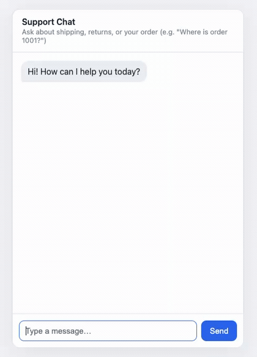
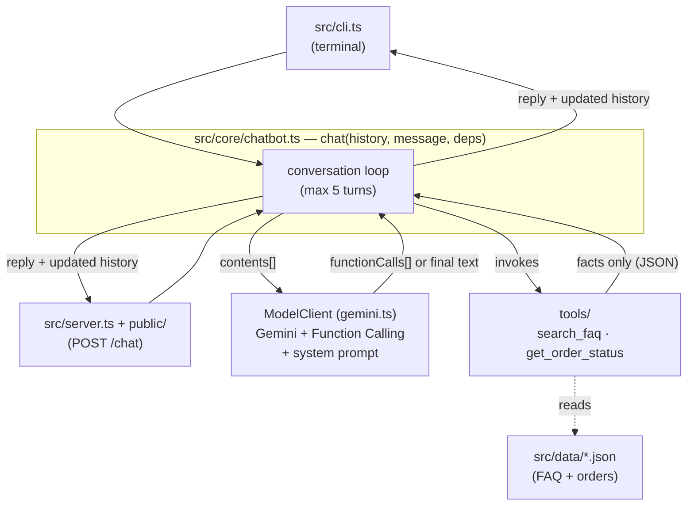

# chatbot

An automated customer-support chatbot for e-commerce, built as a learning project.

It answers **FAQ questions** and **looks up order/product information** using Gemini
with Function Calling. The chat "brain" is a single, stateless, interface-agnostic core
(`chat()`), first driven by a CLI and later by a web chat UI that reuses the same core.

The bot is **read-only**: it only reads FAQ/order data and never mutates state, so it
cannot cancel orders or issue refunds. See the design docs for the reasoning.

## Demo



## Quick start

```bash
npm install
cp .env.example .env   # then add your Gemini API key (https://aistudio.google.com/apikey)
npm run chat           # CLI chatbot
# — or —
npm run serve          # web chat UI at http://localhost:3000
```

Try: `How much is shipping?`, `Where is order 1001?`, `Where is order 9999?`,
`Can you restock this item?` (out-of-scope → routed to support).

## Scripts

| Command | What it does |
| --- | --- |
| `npm run chat` | Run the CLI chatbot (needs `GEMINI_API_KEY`). |
| `npm run serve` | Run the web chat UI (needs `GEMINI_API_KEY`; `PORT` overrides 3000). |
| `npm test` | Run the Vitest suite (tools + chat loop + server route; no API key needed). |
| `npm run typecheck` | Type-check with `tsc --noEmit`. |

Set `GEMINI_MODEL` to override the default model (`gemini-2.5-flash`).

## Architecture

The CLI and web UI are thin shells over one stateless core, `chat()`. Each turn,
the core loops between the model and the read-only tools until the model produces
a final text answer (bounded to 5 round-trips), then hands the reply back.



Data flows one way through the tools — they only ever **read** `src/data/*.json`
and return facts; the model owns all wording. The caller (CLI or browser) holds
the history and passes it back each turn, which is what keeps the core stateless.

## How it works

- **`src/core/chatbot.ts`** — the stateless `chat(history, message, deps)` loop. It calls
  the model, runs any requested tool, feeds the result back, and repeats (bounded to 5
  turns). It depends only on a small injected `ModelClient` seam, so the loop is tested
  with a fake model — no API key required.
- **`src/core/tools/`** — `search_faq` and `get_order_status`. They return **facts only**
  (data or a "not found" marker); wording is the model's job. Both are read-only.
- **`src/core/gemini.ts`** — adapts the `@google/genai` SDK to the `ModelClient` seam.
- **`src/core/prompt.ts`** — the system prompt that turns "no facts" into a safe refusal.
- **`src/cli.ts`** — thin terminal shell over `chat()`.
- **`src/server.ts`** — Express `createApp(deps, chatFn?)`: one `POST /chat` plus static
  files. Stateless — the browser holds history and round-trips it each turn. Same `chat()`,
  same deps as the CLI; the core is untouched.
- **`public/`** — `index.html` + `chat.js`, a vanilla centered chat page (no build step).

Data lives in `src/data/*.json` (dummy FAQ + orders), separate from code.

## Status

Phase 1 (CLI core) and Phase 2 (web chat UI) implemented and tested. The EC-site popup
widget, streaming, and guardrails are future work; see the design docs.

## Documentation

- [ADR-0001: Read-only LLM grounding](docs/adr/0001-read-only-llm-grounding.md) — the
  core architecture decision (why answers are grounded in tools and why the bot is
  read-only).
- [Design: FAQ + Order-lookup Chatbot](docs/design/0001-faq-order-chatbot.md) — how the
  CLI core is built (interface, tools, conversation loop, testing).

## Stack

- TypeScript + Node.js (ESM, run via `tsx`)
- Gemini (`@google/genai`) with Function Calling
- Vitest for tests
