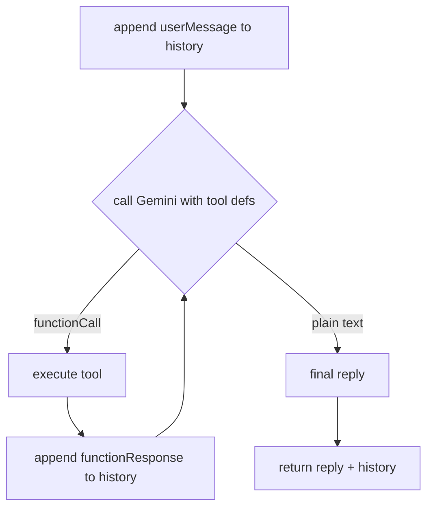

# FAQ + Order-lookup Chatbot: Design Doc

> Requirements/"why" live in the issue; the cross-cutting decision lives in
> [ADR-0001](../adr/0001-read-only-llm-grounding.md). This document is "how to build it".

## Overview

A customer-support chatbot for an e-commerce site that (1) answers FAQ questions and
(2) looks up order/product information, using Gemini with Function Calling. The chat
"brain" is a single stateless core function. The first interface is a CLI; a web chat
UI is planned later and will reuse the same core untouched.

## Background

Learning-oriented project, built from scratch. We start with levels 1 (FAQ) and 2
(order/product lookup); level 3 (taking actions like cancellations) is explicitly out of
scope. The read-only, tool-grounded approach is decided in ADR-0001.

## Goals / Non-goals

- Goal: Answer FAQ questions from a curated FAQ dataset.
- Goal: Answer order-status questions by looking up an order dataset.
- Goal: Refuse gracefully (say "I don't know" + point to support) when tools return
  nothing or no tool applies.
- Goal: Keep the core interface-independent so a web UI can wrap it later.
- Non-goal: Any state-mutating action (cancel/refund/return). Read-only only.
- Non-goal: Guardrails (input moderation / output verification) in this iteration —
  deferred per ADR-0001, addable later without core changes.
- Non-goal: Authorization. `getOrderStatus` is an unauthenticated exact-id lookup over
  fake data, so order IDs are guessable and a caller could read any order's details. This
  is acceptable for a local learning demo only; a real deployment must authenticate the
  user and authorize order access before exposing order data.
- Non-goal: A real database, semantic/embedding search, web UI (all later).

## Design (interface and data)

### Core public interface

```typescript
// src/core/chatbot.ts
// Message/Part mirror the SDK's Content/Part. The exact shape (including how the
// role is attributed for a functionResponse turn) is finalized at implementation
// time against @google/genai's real types — do not treat the fields below as
// frozen; they describe intent, not the pinned SDK signature.
export type Message = {
  role: string;   // SDK content role (e.g. "user" | "model"); SDK-defined
  parts: unknown[]; // SDK Part[]: text | functionCall | functionResponse
};

export type ChatResult = {
  reply: string;       // user-facing text (always present, even on failure)
  history: Message[];  // updated history to pass back on the next turn
};

// Stateless: caller (CLI/web) holds history and passes it back each turn.
// chat() NEVER throws: on API error, tool error, or loop-cap, it returns a
// ChatResult whose `reply` is a fallback message and whose `history` is the
// best-effort updated history. This keeps error handling inside the core so
// every interface (CLI/web) behaves identically.
export function chat(history: Message[], userMessage: string): Promise<ChatResult>;
```

The caller owns conversation state. The core takes prior history + the new message and
returns the reply plus the new history. This is what makes a web wrapper trivial: each
HTTP request supplies its own history.

### Conversation loop



Function Calling is multi-turn: the model may request a tool, we execute it, feed the
result back, and the model then answers or requests another tool. The loop is bounded
(max 5 iterations) to prevent runaway cycles. If the cap is hit without a final text
answer, `chat()` returns a fixed fallback reply (e.g. "Sorry, I couldn't complete that
— please contact `support@example.com`") rather than looping further.

### Tools

```typescript
// src/core/tools/searchFaq.ts
// Returns facts only. No user-facing wording, no apology, no routing.
export function searchFaq(query: string): {
  matches: Array<{ question: string; answer: string }>; // may be empty
};

// src/core/tools/getOrderStatus.ts
export type OrderResult =
  | { found: true; status: string; eta: string; items: string[] }
  | { found: false };

export function getOrderStatus(orderId: string): OrderResult;
```

- `searchFaq` reads `src/data/faq.json`, scores entries by simple keyword/substring
  overlap against `query`, and returns the **top 3** by score descending, ties broken by
  file order (empty array if nothing matches). Deterministic order keeps unit tests
  stable.
- `getOrderStatus` reads `src/data/orders.json`, looks up by exact `orderId`.

Tool declarations (the schema handed to Gemini) live in `src/core/tools/index.ts`.

### System prompt

`src/core/prompt.ts` exports the system prompt enforcing the grounding rules from
ADR-0001: answer order/product facts only from tool results; on "not found" or no
applicable tool, do not guess — say it's unknown and point to `support@example.com`;
keep answers short and polite.

### Module layout

```text
src/
  core/
    chatbot.ts          // chat() — conversation loop
    gemini.ts           // thin Gemini SDK wrapper (model, temperature)
    prompt.ts           // system prompt
    tools/
      index.ts          // tool declarations passed to Gemini
      searchFaq.ts
      getOrderStatus.ts
  data/
    faq.json            // ~10 curated Q/A entries
    orders.json         // a few fake orders
  cli.ts                // thin CLI shell (readline) over chat()
  config.ts             // env loading (GEMINI_API_KEY), fail fast if missing
```

Everything under `core/` is interface-agnostic (knows nothing about CLI or web).

### Model / config

- SDK: `@google/genai`. Model: a fast Gemini chat model (e.g. `gemini-2.5-flash`),
  pinned in `gemini.ts`.
- `temperature: 0.2` to suppress invention (mitigation, not a guarantee — ADR-0001).
- `GEMINI_API_KEY` read from env via `config.ts`; never hardcoded.

## Behavioral invariants

- Credentials only via env (`GEMINI_API_KEY`); never hardcoded or logged.
- No state-mutating tool exists; the bot is read-only (ADR-0001).
- Order/product answers derive **only** from tool results; on `found: false` /
  `matches: []` / no applicable tool, the bot must not fabricate and must route to
  support.
- Tools return data only — no user-facing phrasing inside tools.
- `chat()` is stateless: identical (history, message) inputs produce no hidden
  cross-call state; the loop is bounded (≤ 5 iterations).
- `core/` has no dependency on any interface layer (CLI/web).

## Testing approach

- **Tool unit tests (no LLM, primary):** `searchFaq("shipping")` → returns the shipping
  entry; `searchFaq("xyzxyz")` → `matches: []`. `getOrderStatus("1001")` →
  `found: true` with expected fields; `getOrderStatus("9999")` → `found: false`.
- **Loop tests (mocked Gemini):** a fake client scripts "functionCall then text"; assert
  `chat()` executes the tool, appends the functionResponse, returns the final text, and
  honors the iteration cap and API-error fallback.
- **Manual (real Gemini, few cases):** run the CLI for: order found, order not found,
  FAQ hit, FAQ miss, and an out-of-scope question (expect support routing).
- Tooling: Vitest. Development follows TDD: tools → loop → CLI, tests first.

## Acceptance criteria

**Automatically verifiable (unit / mocked-loop tests):**

- [ ] `searchFaq` / `getOrderStatus` return facts only (no user-facing wording) and the
      correct "not found" markers; FAQ results are top-3, deterministically ordered.
- [ ] In a mocked-loop test, `chat()` executes a requested tool, appends its
      functionResponse, and returns the model's final text.
- [ ] Conversation loop is bounded (≤ 5); on cap, API error, or tool error, `chat()`
      does not throw and returns a fallback `reply`.
- [ ] No state-mutating tool exists; `GEMINI_API_KEY` is read only from env.
- [ ] `core/` imports nothing from the CLI layer.
- [ ] Tool unit tests and mocked-loop tests pass under Vitest.

**Manually observed (real Gemini, qualitative — not a pass/fail gate, per ADR-0001):**

- [ ] FAQ question → answer drawn from `searchFaq` results.
- [ ] Order-status question → answer drawn from `getOrderStatus` results.
- [ ] Unknown order / no FAQ match / out-of-scope question → no fabrication observed,
      routes to `support@example.com`.
- [ ] README documents setup (env var, install, run).

## Risks and rollout

- Risk: LLM may still produce a wrong sentence despite grounding (accepted for read-only
  scope; mitigated by tools + prompt + low temperature — ADR-0001).
- Risk: Naive keyword FAQ search can miss phrasing variants. Acceptable for ~10 entries;
  semantic search is a future option.
- Risk: Read-side data exposure. The read-only guarantee (ADR-0001) prevents *write*
  damage, but does not prevent leaking another user's order info via guessable IDs — see
  the authorization non-goal. Out of scope here; required before any real deployment.
- Risk: `@google/genai` API surface/model names may differ from assumptions — verify
  against current docs during implementation before pinning.
- Rollout: Phase 1 CLI core (this design). Phase 2 web UI wrapping the same `chat()`.
  Guardrails added later as independent input/output layers without core changes.

## References

- Related ADR: [ADR-0001](../adr/0001-read-only-llm-grounding.md)
- Future: web UI phase, optional guardrails, optional DB/semantic search.
